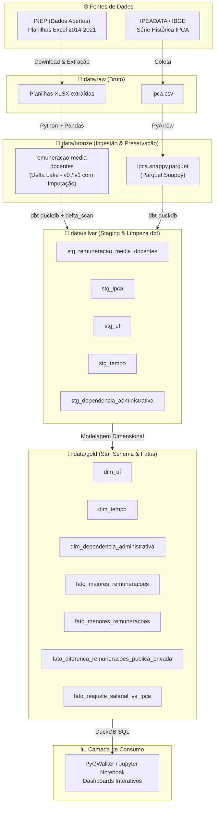

# 📊 Pipeline de Dados: Remuneração Média dos Docentes no Brasil & IPCA

Pipeline de Engenharia de Dados ponta a ponta (*End-to-End*) desenvolvido com **Arquitetura Medalhão** (Raw, Bronze, Silver, Gold), utilizando **Python**, **Delta Lake**, **DuckDB**, **dbt** e **PyGWalker**.

O projeto analisa a série histórica (2014–2021) da remuneração média de professores da educação básica no Brasil por Unidade Federativa (UF) e rede de ensino (Pública vs. Privada), correlacionando o crescimento salarial com os índices de inflação acumulada (**IPCA**).

---

## 📌 Sumário

- [Visão Geral e Objetivos](#-visão-geral-e-objetivos)
- [Arquitetura da Solução](#-arquitetura-da-solução)
- [Fontes de Dados](#-fontes-de-dados)
- [Estrutura do Projeto](#-estrutura-do-projeto)
- [Camadas de Dados](#-camadas-de-dados)
  - [Raw (Dados Brutos)](#1-camada-raw)
  - [Bronze (Ingestão & Time Travel)](#2-camada-bronze)
  - [Silver (Limpeza & Staging)](#3-camada-silver)
  - [Gold (Modelagem Dimensional Star Schema)](#4-camada-gold)
- [Análise Exploratória e Visualização](#-análise-exploratória-e-visualização)
- [Stack Tecnológica](#-stack-tecnológica)
- [Instalação e Execução](#-instalação-e-execução)
- [Governança e Testes de Qualidade](#-governança-e-testes-de-qualidade)

---

## 🎯 Visão Geral e Objetivos

O principal objetivo deste projeto é construir um pipeline analítico robusto e reprodutível capaz de responder a questões fundamentais sobre a valorização docente no Brasil:

1. **Maiores e Menores Remunerações**: Quais são os 5 estados (UFs) com maiores e menores médias salariais docentes ano a ano?
2. **Disparidade Pública vs. Privada**: Qual a diferença (em valor absoluto e percentual) entre as remunerações pagas pela rede pública e pela rede privada em cada estado?
3. **Poder de Compra e Ganho Real**: O reajuste salarial médio dos docentes superou a inflação medida pelo IPCA no período, gerando ganho real, ou houve perda do poder de compra?

---

## 🏛 Arquitetura da Solução

O projeto segue os princípios da **Arquitetura Medalhão**, garantindo rastreabilidade, isolamento de responsabilidades e qualidade progressiva dos dados:



---

## 🌐 Fontes de Dados

| Fonte | Descrição | Formato | Período |
| :--- | :--- | :--- | :--- |
| **[INEP](https://www.gov.br/inep/pt-br/acesso-a-informacao/dados-abertos/indicadores-educacionais)** | Indicadores Educacionais de Remuneração Média dos Docentes da Educação Básica por UF e Dependência Administrativa. | `.zip` contendo `.xlsx` | 2014 – 2021 |
| **[IPEADATA](https://www.ipeadata.gov.br/ExibeSerie.aspx?serid=1410807112&module=M)** | Série histórica anual do Índice Nacional de Preços ao Consumidor Amplo (IPCA). | `.csv` | 2015 – 2021 |

---

## 📂 Estrutura do Projeto

```text
pipeline-dados-remuneracao-docentes/
├── data/                                 # Diretório de dados gerado pela execução do pipeline
│   ├── raw/                              # Dados brutos baixados e extraídos
│   ├── bronze/                           # Tabelas Delta Lake e Parquet brutos
│   ├── silver/                           # Arquivos Parquet das tabelas de staging
│   └── gold/                             # Arquivos Parquet das dimensões e fatos
├── dbt/                                  # Projeto dbt (Data Build Tool)
│   ├── models/
│   │   ├── sources.yml                   # Mapeamento das fontes Bronze para DuckDB
│   │   ├── silver/                       # Modelos de Staging (limpeza, tipagem)
│   │   │   ├── schema.yml                # Testes e documentação da Silver
│   │   │   ├── stg_dependencia_administrativa.sql
│   │   │   ├── stg_ipca.sql
│   │   │   ├── stg_remuneracao_media_docentes.sql
│   │   │   ├── stg_tempo.sql
│   │   │   └── stg_uf.sql
│   │   └── gold/                         # Modelos Dimensionais (Star Schema)
│   │       ├── schema.yml                # Testes de integridade (FKs) e documentação da Gold
│   │       ├── dim_dependencia_administrativa.sql
│   │       ├── dim_tempo.sql
│   │       ├── dim_uf.sql
│   │       ├── fato_diferenca_remuneracoes_publica_privada.sql
│   │       ├── fato_maiores_remuneracoes.sql
│   │       ├── fato_menores_remuneracoes.sql
│   │       └── fato_reajuste_salarial_vs_ipca.sql
│   ├── dbt_project.yml                   # Configurações do dbt e materializações externas
│   ├── packages.yml                      # Dependências (ex: dbt_utils)
│   └── profiles.yml                      # Configuração do perfil DuckDB
├── pipeline.ipynb                        # Notebook orquestrador ponta a ponta
└── README.md                             # Documentação técnica do projeto
```

---

## ⚙ Camadas de Dados

### 1. Camada Raw
- Download programático das séries históricas do INEP com tratamento de exceções e até 5 tentativas de retentativa (*retry*).
- Descompactação das planilhas em `data/raw/remuneracao-media-docentes/<ano>.xlsx`.
- Gravação do arquivo bruto de referência da inflação em `data/raw/ipca.csv`.

### 2. Camada Bronze
- **Ingestão & Preservação**: Conversão das planilhas brutas em formato **Delta Lake** (`data/bronze/remuneracao-media-docentes`), preservando inconsistências originais (como caracteres `*` e `d` convertidos para nulos).
- **Time Travel & Imputação**:
  - Detecção de nulos históricos em registros de remuneração (ex.: RJ em 2014 e RO em 2021).
  - Correção/imputação via Pandas e sobrescrita controlada na tabela Delta.
  - Gravação da versão 1 mantendo o histórico de auditoria completo (disponível para consulta via `delta_scan(..., version=0)` vs. `version=1`).

### 3. Camada Silver
Orquestrada pelo **dbt** com o adaptador `dbt-duckdb`, lendo via extensão `delta_scan` e gravando em formato Parquet:
- **`stg_remuneracao_media_docentes`**: Padronização dos nomes de dependências administrativas (caixa alta e remoção de acentos via `strip_accents`), coerção de tipos numéricos e valores decimais.
- **`stg_ipca`**: Tipagem de ano e taxa percentual de inflação.
- **`stg_uf`**, **`stg_tempo`**, **`stg_dependencia_administrativa`**: Criação de bases normalizadas para as dimensões analíticas.

### 4. Camada Gold
Modelação dimensional no padrão **Star Schema** com chaves substitutas (*Surrogate Keys*) geradas pelo `dbt_utils.generate_surrogate_key`:

#### Dimensões
- **`dim_uf`**: `uf_sk` (Hash MD5), `uf`.
- **`dim_tempo`**: `tempo_sk` (Hash MD5), `ano`.
- **`dim_dependencia_administrativa`**: `dependencia_administrativa_sk` (Hash MD5), `dependencia_administrativa`.

#### Tabelas Fato
- **`fato_maiores_remuneracoes`**: Top 5 UFs com as remunerações mais altas por ano e categoria de gestão.
- **`fato_menores_remuneracoes`**: Top 5 UFs com as menores remunerações médias por ano.
- **`fato_diferenca_remuneracoes_publica_privada`**: Comparação entre rede pública e privada (diferença absoluta em R$ e variação percentual).
- **`fato_reajuste_salarial_vs_ipca`**: Cálculo do reajuste salarial anual acumulado através de funções de janela (`LAG()`), confronto direto com o IPCA, cálculo de **ganho real** e classificação de desempenho (`POSITIVO` vs. `NEGATIVO`).

---

## 📈 Análise Exploratória e Visualização

Ao final da camada Gold, o notebook integra **DuckDB** e **PyGWalker** para possibilitar análise visual interativa via *drag-and-drop*:

- Gráficos comparativos de dispersão e barras para identificar disparidades salariais regionais.
- Curvas temporais do reajuste docente contrapostas à curva da inflação.
- Mapas e rankings dinâmicos de remuneração por unidade federativa.

---

## 🛠 Stack Tecnológica

| Componente | Tecnologia | Finalidade |
| :--- | :--- | :--- |
| **Linguagem** | Python 3.10+ | Scripts de extração, tratamento e automação |
| **Armazenamento / Lakehouse** | Delta Lake (`deltalake`) | ACID transactions, versionamento e Time Travel na Bronze |
| **Processamento Local** | DuckDB | Motor SQL analítico de alta performance integrado ao Parquet/Delta |
| **Transformação & Modelagem** | dbt (`dbt-duckdb`, `dbt_utils`) | Criação dos modelos Silver e Gold, testes e documentação |
| **Formato de Dados** | Apache Parquet (Snappy) | Armazenamento colunar otimizado para analytics |
| **Visualização** | PyGWalker / HTML | Dashboard e exploração visual interativa no notebook |

---

## 🚀 Instalação e Execução

### 1. Pré-requisitos
- Python 3.10 ou superior
- Git instalado (opcional)

### 2. Instalação das Dependências

Instale os pacotes necessários:

```bash
pip install pandas openpyxl deltalake pyarrow duckdb dbt-duckdb pygwalker
```

### 3. Instalação dos Pacotes dbt

Entre no diretório do dbt e baixe as dependências do `dbt_utils`:

```bash
cd dbt
dbt deps
cd ..
```

### 4. Executando o Pipeline

O pipeline pode ser executado de duas formas:

#### Opção A: Via Jupyter Notebook (Recomendado)
Abra e execute as células do arquivo [pipeline.ipynb](pipeline.ipynb) sequencialmente. O notebook executa:
1. Download e descompactação dos dados brutos.
2. Ingestão na camada Bronze (Delta Lake e Parquet).
3. Correção de nulos com auditoria Time Travel.
4. Compilação e materialização da camada Silver via dbt.
5. Construção das dimensões e fatos da camada Gold via dbt.
6. Renderização dos gráficos interativos PyGWalker.

#### Opção B: Execução Manual dos Modelos dbt via Terminal
Se os dados das camadas Raw e Bronze já foram baixados:

```bash
cd dbt

# Executar e testar a camada Silver
dbt build --select silver

# Executar e testar a camada Gold
dbt build --select +gold

# Gerar e visualizar a documentação interativa do dbt
dbt docs generate
dbt docs serve
```

---

## 🛡 Governança e Testes de Qualidade

A integridade do pipeline é garantida de forma automatizada através dos testes nativos do dbt e do `dbt_utils`:

- **Unicidade e Nulos**: Testes `unique` e `not_null` em chaves primárias e surrogates.
- **Valores Aceitos**: Testes `accepted_values` validando categorias válidas para `dependencia_administrativa` (`ESTADUAL`, `PRIVADA`, `PUBLICA`).
- **Integridade Referencial**: Testes `relationships` assegurando que todas as chaves estrangeiras (`tempo_sk`, `uf_sk`) nas tabelas Fato possuem correspondência direta nas tabelas de Dimensão.
- **Linhagem e Dicionário de Dados**: Disponibilizados através do catálogo nativo gerado pelo `dbt docs`.
